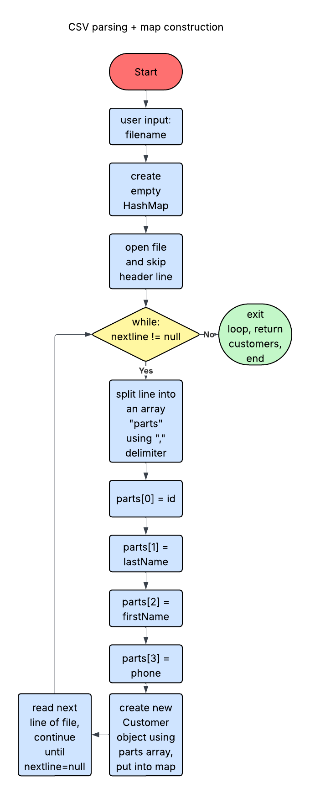
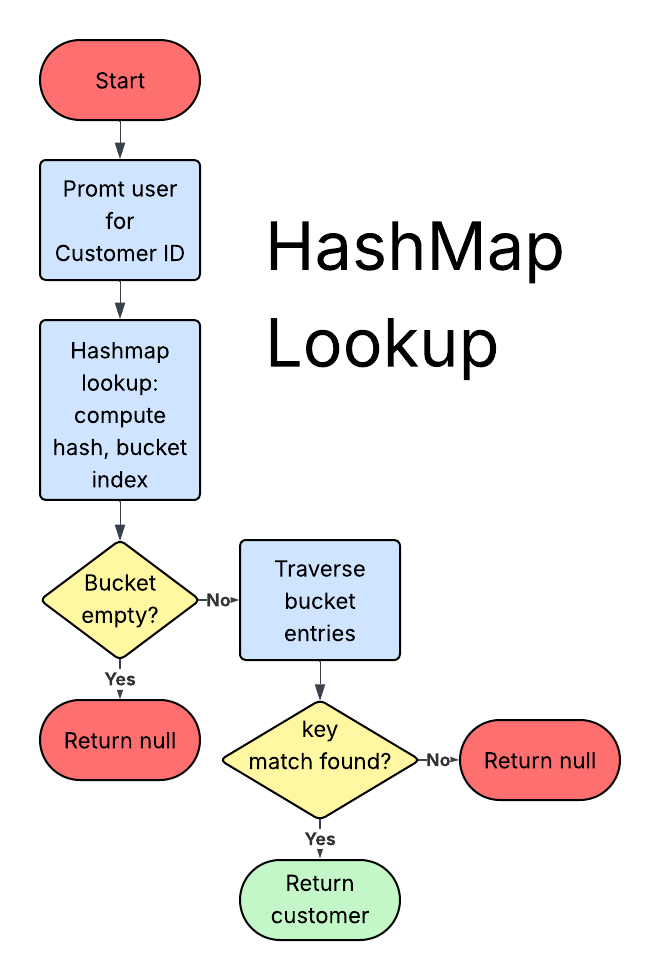

[](https://classroom.github.com/open-in-codespaces?assignment_repo_id=21972994)

Nathanael Obrey

12/6/2025

# Final Project Report

## What does my app do, and how is it useful?
This program is a simple business app designed to be used by a tech company or other relevant store. It has a variety of useful features that allows a company to handle transactions and purchase history, all while staying organized.

My program uses this data and displays a menu to allow the user to do the following actions:
```
=== Business App Menu ===
1. Add Customer
2. Delete Customer
3. Search Customer by ID
4. List All Customers
5. Add Transaction
6. View Purchase History
7. Exit
```

## What three algorithms did I use for my code?

### CSV parsing + map construction:

This algorithm is included twice in this application: `DataLoader.loadCustomers(...)` and `DataLoader.loadPurchases(...)`. My program utilizes two separate CSV (Comma Separated Variable) files. The first file (<ins>customers.csv</ins>) is stored in the following format: `customerID,lastName,firstName,phone`.  The second file (<ins>purchases.csv</ins>) is stored in the following format: `customerID,productName,price`. The CSV parser will read through the code and use "," (comma) as a delimiter (separator). That data is then put into a new Customer Object, and is then put into a HashMap, using the Customer ID as the key. The Big O time complexity of the parsing algorithm is **O(n)**, where ***n*** is the number of lines in the CSV file. It is important to know that while I used Chat-GPT to help me with the general layout of this code, I did end up coding the majority of these algorithms, as I thought that it was important that I know how the code works.

Example:
```
public static Map<Integer, Customer> loadCustomers(String filename) throws IOException {
        Map<Integer, Customer> customers = new HashMap<>();
        try (BufferedReader br = new BufferedReader(new FileReader(filename))) {
            String line = br.readLine(); // skip header
            while ((line = br.readLine()) != null) {
                String[] parts = line.split(",");
                int id = Integer.parseInt(parts[0]);
                String lastName = parts[1];
                String firstName = parts[2];
                String phone = parts[3];
                customers.put(id, new Customer(id, lastName, firstName, phone));
            }
        }
        return customers;
    } 
```

Flowchart explaining this algorithm (using sudo code of parsing `customers.csv`):



### HashMap Lookup

One of the most important algorithms in this application is the HashMap Lookup. The whole basis of this program revolves around doing certain actions after a customer ID is entered into the terminal. After the user is prompted to enter a customer ID, the code will internally compute the hash code, map it to a bucket index and check if that bucket is empty. If it is not empty, the code will then check if a matching key exists, then will return the information assiciated with they inputed key. In this case, that would be the customer's name and phone number. The time complexity of this lookup is O(1), also known as Constant-time, meaning it takes the same time no matter where the information is stored in the hash table.

As an example, here is the code of the `searchCustomer` method:

```
private static void searchCustomer(Scanner sc, Map<Integer, Customer> customers) {
        System.out.print("Enter Customer ID: ");
        int id = sc.nextInt();
        Customer c = customers.get(id);
        if (c != null) { // if customer exists
            System.out.println("Found: " + c.getFirstName() + " " + c.getLastName() + " (" + c.getPhone() + ")"); // display customer info
        } else { // if customer does not exist
            System.out.println("Customer not found.");
        }
    } // end searchCustomer
```

Here is also a flowchart of how HashMap Lookup works:

