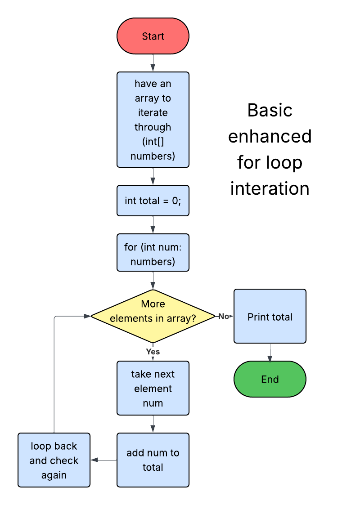

[](https://classroom.github.com/open-in-codespaces?assignment_repo_id=21972994)

Nathanael Obrey

12/6/2025

# Final Project Report

## What does my app do, and how is it useful?
This program is a simple business app designed to be used by a tech company or other relevant store. It has a variety of useful features that allows a company to handle transactions and purchase history, all while staying organized.

My program uses this data and displays a menu to allow the user to do the following actions:
```
=== Business App Menu ===
1. Add Customer
2. Delete Customer
3. Search Customer by ID
4. List All Customers
5. Add Transaction
6. View Purchase History
7. Exit
```

## What three algorithms did I use for my code?

### CSV parsing + map construction:

This algorithm is included twice in this application: `DataLoader.loadCustomers(...)` and `DataLoader.loadPurchases(...)`. My program utilizes two separate CSV (Comma Separated Variable) files. The first file (<ins>customers.csv</ins>) is stored in the following format: `customerID,lastName,firstName,phone`.  The second file (<ins>purchases.csv</ins>) is stored in the following format: `customerID,productName,price`. The CSV parser will read through the code and use "," (comma) as a delimiter (separator). That data is then put into a new Customer Object, and is then put into a HashMap, using the Customer ID as the key. The Big O time complexity of the parsing algorithm is **O(n)**, where ***n*** is the number of lines in the CSV file. It is important to know that while I used Chat-GPT to help me with the general layout of this code, I did end up coding the majority of these algorithms, as I thought that it was important that I know how the code works.

Example:
```
public static Map<Integer, Customer> loadCustomers(String filename) throws IOException {
        Map<Integer, Customer> customers = new HashMap<>();
        try (BufferedReader br = new BufferedReader(new FileReader(filename))) {
            String line = br.readLine(); // skip header
            while ((line = br.readLine()) != null) {
                String[] parts = line.split(",");
                int id = Integer.parseInt(parts[0]);
                String lastName = parts[1];
                String firstName = parts[2];
                String phone = parts[3];
                customers.put(id, new Customer(id, lastName, firstName, phone));
            }
        }
        return customers;
    } 
```

Flowchart explaining this algorithm (using sudo code of parsing `customers.csv`):


### HashMap Lookup

One of the most important algorithms in this application is the HashMap Lookup. The whole basis of this program revolves around doing certain actions after a customer ID is entered into the terminal. After the user is prompted to enter a customer ID, the code will internally compute the hash code, map it to a bucket index and check if that bucket is empty. If it is not empty, the code will then check if a matching key exists, then will return the information assiciated with they inputed key. In this case, that would be the customer's name and phone number. The time complexity of this lookup is O(1), also known as Constant-time, meaning it takes the same time no matter where the information is stored in the hash table.

As an example, here is the code of the `searchCustomer` method:

```
private static void searchCustomer(Scanner sc, Map<Integer, Customer> customers) {
        System.out.print("Enter Customer ID: ");
        int id = sc.nextInt();
        Customer c = customers.get(id);
        if (c != null) { // if customer exists
            System.out.println("Found: " + c.getFirstName() + " " + c.getLastName() + " (" + c.getPhone() + ")"); // display customer info
        } else { // if customer does not exist
            System.out.println("Customer not found.");
        }
    } // end searchCustomer
```

Here is also a flowchart of how HashMap Lookup works:


### Iterative Looping

While simple in design, almost every program has some sort of iterative looping, usually in the form of a for loop. In my program, I have implemented looping to calculate the total amount that a customer has spent. While this is a simple design, I do have future plans to use this type of looping to then calculate and keep track of the total revenue of the company. Due to this being a non-nested for loop, the time complexity of this algorithm is O(n). My specific use case in my program uses an enhanced for loop, which is useful for iterating through all of the elements of an array without having to worry about managing and index. (e.x. `for (int number: arrayOfStuff)`)

Here is the simple algorithm implementation:

```
for (Purchase p : c.getPurchases()) {
    System.out.println(" - " + p.getProductName() + " ($" + p.getPrice() + ")");
    total += p.getPrice();
    }
System.out.printf("Total: $%.2f\n", total);
```

Here is a basic for loop explaining this concept:



## What data structures did I use?

### HashMap

As mentioned before, I predominantly utilized the HashMap data structure throughout my program. The main reason for this is its constant-time key lookup time. This makes it so no matter how the list of customers gets, the look up time is the exact same time for any key. The use of a HashMap made programming this project very simple and straight forward to program.

### ArrayList

While most of my data was stored in a HashMap, there were a few cases where taking that data and storing it into an ArrayList made more sense. I used and ArrayList to store customer purchase history when prompted by the user. This made outputing this data much easier, and allowing me to easily iterate through the ArrayList whenever it was needed.

### LinkedList

Lastly, I implemented a receipt system that used a LinkedList. My original reason to use a Linked List was to keep the header and footer of the receipt the same so that they were consistent for every transaction, while changing the middle with the transaction data. I have future plans to implement a system to export these receipts to printable files, but ran out of time. As of now, I do have the receipt print out in the terminal after a purchase is added.

## Where in the process did I encounter an opportunity, how did I used it?

During my design process, I realized that I wanted to do some sort of business based app that would read and write to a csv file with a large amount of data. My first idea was to utilize some sort of product ID or customer ID, and use that as a key in a HashMap due to the very efficient lookup time, without the need of a sorting algorithm. This was a very obvious pathway for me from the very start of the design process.

## What is a step in the developing process where you encountered an error, and how did you resolve it?

I has a difficult time getting the data from the csv files to correctly fill into the HashMap. It ended up being a problem with my CSV parsing method. I was storing the information as local variables at the time. I ended up storing them in an array, and then creating a new Customer object that would then be added to the HashMap.

## What do I plan on changing or adding in the future?

I have a few plans for this project looking forward. The first idea that comes to mind is implementing a GUI to my program. Another idea I have is to have the program store receipts into a printable file, and upgrade the purchasing system to allow more than one item in each transaction.